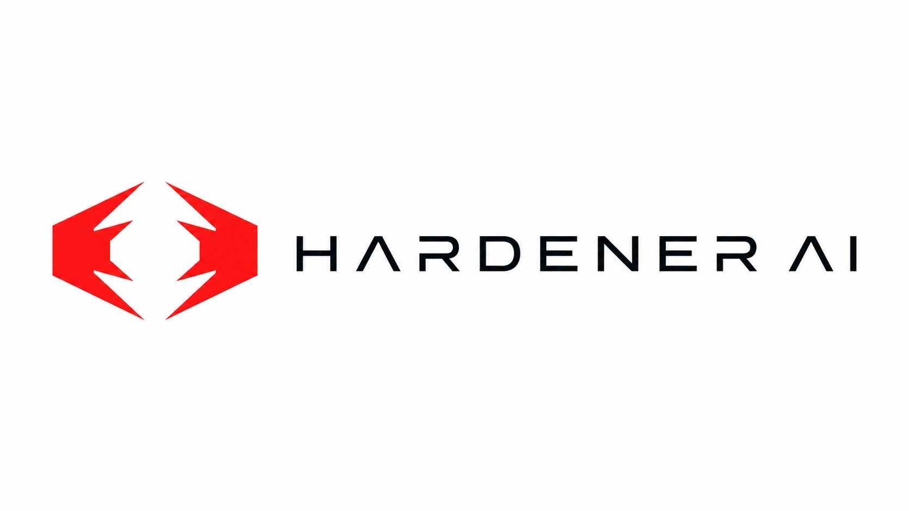

<p align="center">
  
</p>

# Sanctuary

**The security runtime for AI agents on macOS.**

Capability scoping. Human approval. Containment. Tamper-resistant audit.

Sanctuary is open-source infrastructure for running AI coding agents such as
Claude Code, Cursor, Codex-style CLIs, and Computer Use on macOS without handing
them unbounded user privilege. Agents request capabilities; users approve
sensitive grants; every important event is recorded in a hash-chained audit log
that cannot be silently rewritten.

Sanctuary is built by [Hardener](https://hardener.ai). The runtime is AGPL v3.
Hardener Cloud is the enterprise control plane on top.

> Status: v0.1 pre-launch. The code is open for review and contribution.
> Signed production binaries are not yet available.

[](LICENSE)
[](SECURITY.md)
[](README.md)

## The Problem

AI coding agents are moving onto developer laptops. They read source, write
files, execute shells, connect to services, and run inside workspaces that often
sit beside SSH keys, cloud credentials, browser profiles, wallet state, and
password manager data.

Today most agents inherit the user's full local privilege. Security and IT teams
have no clean answer to:

- What did the agent touch?
- Was that access approved?
- Can we revoke the grant?
- Can we prove what happened later?

Sanctuary is that answer for macOS.

## Architecture

```text
   Agent / IDE / Computer Use
   Claude Code · Cursor · Codex-style CLI · browser operator
                    |
                    | request capabilities / emit audit
                    v
   +--------------------------------------------------+
   |             Sanctuary OSS Runtime                |
   |                                                  |
   |  capability policy     local owner approval      |
   |  policy DB             FSEvents + pf             |
   |  CDP Guard             tamper-evident audit      |
   |  peer-monitored daemon Security Overview         |
   +--------------------------------------------------+
                    |
                    | fleet policy / audit export
                    v
   +--------------------------------------------------+
   |   Hardener Cloud Enterprise Control Plane         |
   |   central policy · SSO · SIEM · compliance        |
   +--------------------------------------------------+
```

The runtime runs locally and is fully functional standalone. Hardener Cloud is
optional and only relevant for team and enterprise deployments.

## What Ships Today

- **Agent classifier** with a known-agent registry, runtime detection, and
  parent-chain inspection.
- **Policy DB** for protected folders, sensitive extensions, user-tagged agents,
  and trusted paths.
- **FSEvents-backed detection** for protected folders and sensitive extension
  storage.
- **CDP Guard** using `pf` redirect to block agent access to protected Chromium
  browser debug sessions.
- **Tamper-evident audit log** with per-entry signatures and a SHA-256 hash
  chain.
- **Peer-monitored daemon** with `pf` rule revalidation and tamper response.
- **SMAppService daemon install** flow with admin approval.
- **Menu bar console** with onboarding, activity feed, protections list, and
  Security Overview.
- **End-to-end attack scenarios** covering the primary threat models.
- **410 tests** on `main`.

## Not Yet Shipped

The following appeared in early v0.1 design notes but are deferred:

- Clipboard mediation.
- Keychain access mediation.
- Screen-capture mediation.
- Full Endpoint Security enforcement and filesystem invisibility, pending
  Apple's `com.apple.developer.endpoint-security.client` entitlement.
- Runtime SDK server implementation, currently specified in
  [`docs/SDK.md`](docs/SDK.md).

## Beachhead Use Case

If you run Claude Code, Cursor, Codex-style CLIs, or another local agent that
can execute shell commands, Sanctuary gives you visibility and containment
around the obvious exfiltration paths:

- `~/.ssh/` for SSH private keys.
- `~/.aws/`, `~/.azure/`, `~/.config/gcloud/` for cloud credentials.
- Wallet and password manager browser extension storage.
- Standalone wallet app data directories.
- Chrome, Brave, Arc, Edge, Vivaldi, and Opera profile surfaces.
- Custom protected folders you add yourself.

In v0.1, detected activity against these paths appears in the menu bar activity
feed and is appended to the tamper-evident audit log. Touch ID is used today for
daemon installation and protection removal. v0.2 adds runtime Touch ID approvals
for capability grants so agents can ask for narrow, workspace-scoped access
instead of inheriting broad user privilege.

## SDK Preview

Agents will integrate with Sanctuary by requesting capabilities from the local
runtime.

```http
POST /v1/capabilities/request
Authorization: Bearer <session-token>

{
  "capability": "file.write",
  "scope": { "path": "~/src/auth", "recursive": true },
  "duration": "session"
}
```

The recommended production transport is a Unix domain socket. A loopback HTTP
bridge is reserved for development and cross-language prototyping. See
[`docs/SDK.md`](docs/SDK.md).

The SDK is the cooperative path. Agents that do not integrate still fall back to
generic observation and interception through FSEvents, `pf`, and, after
entitlement approval, Endpoint Security.

## Install From Source

Signed and notarized builds are in flight.

```sh
git clone https://github.com/Hardener-ai/sanctuary
cd sanctuary
swift build -c release
./Sources/SanctuaryMenuBar/scripts/bundle.sh
open dist/SanctuaryMenuBar.app
```

`bundle.sh` produces the `.app` bundle from the SwiftPM executable output. The
daemon installs through `SMAppService` on first launch and prompts for admin
approval. The menu bar app guides first-run setup.

> A Homebrew cask is planned but not yet published.

## Verify It Works

```sh
swift test
```

Current target: **410 tests passing**.

Run the reproducible attack scenarios:

```sh
./e2e/run-all.sh
```

Expected without `E2E_PF=1`: **6 PASS / 2 SKIP**.

Run the `pf`-backed CDP and tamper scenarios:

```sh
E2E_PF=1 ./e2e/run-all.sh
```

Expected with sudo configured: **8 PASS**.

## Key Specs

- [`THREAT_MODEL.md`](specs/THREAT_MODEL.md) - what Sanctuary protects and what
  it does not.
- [`COVERAGE_GAPS.md`](specs/COVERAGE_GAPS.md) - frank gap inventory.
- [`CLASSIFIER_SPEC.md`](specs/CLASSIFIER_SPEC.md) - how agents are identified.
- [`CDP_GUARD_SPEC.md`](specs/CDP_GUARD_SPEC.md) - how browser CDP attacks are
  blocked.
- [`FSEVENTS_DETECTION_SPEC.md`](specs/FSEVENTS_DETECTION_SPEC.md) - v0.1
  filesystem detection path.
- [`CAPABILITY_SCOPING_SPEC.md`](specs/CAPABILITY_SCOPING_SPEC.md) - v0.2
  capability grants.
- [`HUMAN_APPROVAL_SPEC.md`](specs/HUMAN_APPROVAL_SPEC.md) - v0.2 local owner
  approval model.
- [`INVISIBILITY_SPEC.md`](specs/INVISIBILITY_SPEC.md) - v0.2 Endpoint Security
  protection model.
- [`SECURITY_OVERVIEW_SPEC.md`](specs/SECURITY_OVERVIEW_SPEC.md) - shipped
  local security overview.

## Roadmap

| Version | Focus |
| --- | --- |
| v0.1 | Local runtime: detection, policy, CDP Guard, audit, menu bar console. |
| v0.2 | Capability runtime: explicit scopes, Touch ID approvals, SDK, ES enforcement. |
| v0.3 | Hardener Cloud: central policy, fleet audit, SSO, admin dashboard, compliance. |
| v1.0 | Standardization: shared core and SDK adoption across major agent vendors. |

Real screenshots and demo video will be added after Developer ID signing and a
real recorded walkthrough.

## License, Commercial Use, and Trademarks

Sanctuary is licensed under the GNU Affero General Public License v3.0. See
[`LICENSE`](LICENSE).

Hardener Cloud is a commercial product. Commercial runtime licensing is
available for proprietary embedding. See [`COMMERCIAL.md`](COMMERCIAL.md).

The names "Sanctuary" and "Hardener" are trademarks of Hardener. See
[`TRADEMARKS.md`](TRADEMARKS.md).

## Security Reports

Do not file public GitHub issues for vulnerabilities.

Email: **hello@hardener.ai**

See [`SECURITY.md`](SECURITY.md).

## Contributing

Sanctuary is early. We are actively looking for:

- Agent vendors interested in early SDK integration.
- Security-conscious teams willing to pilot the runtime on developer laptops.
- Contributors with macOS internals, Endpoint Security, or `pf` experience.

Open an issue or reach out at `hello@hardener.ai`.
