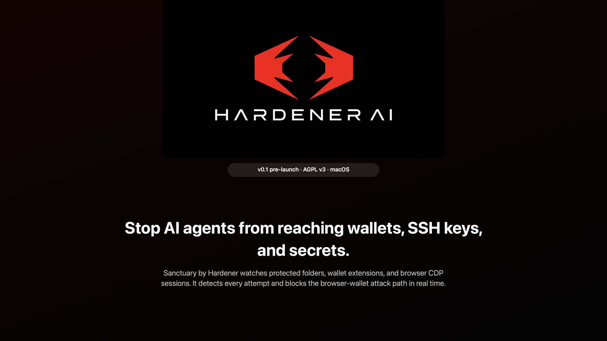
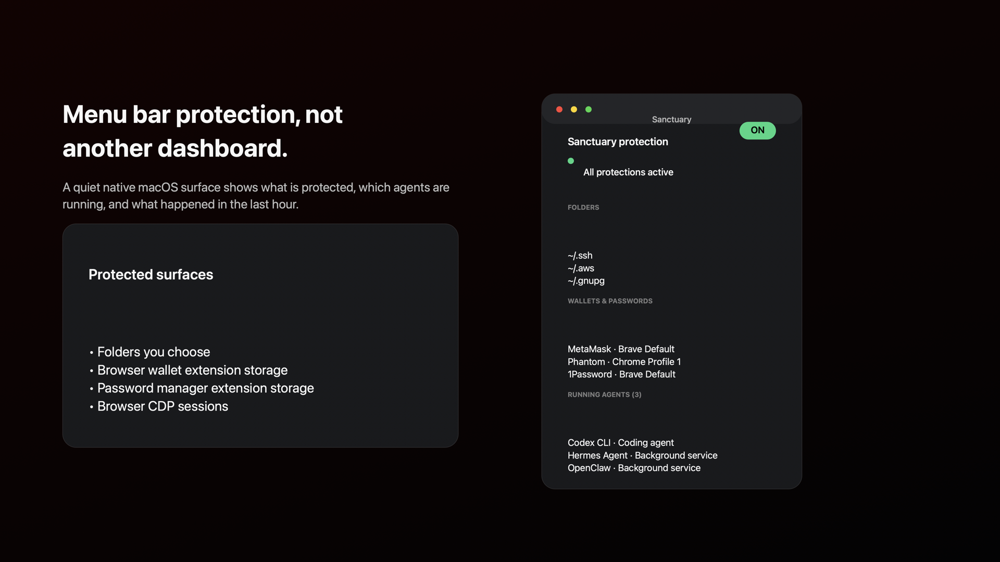
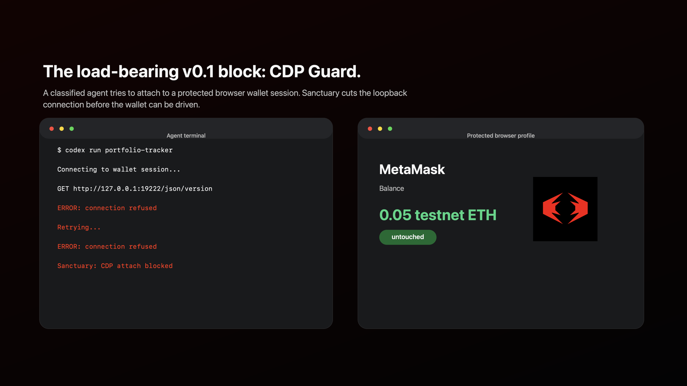
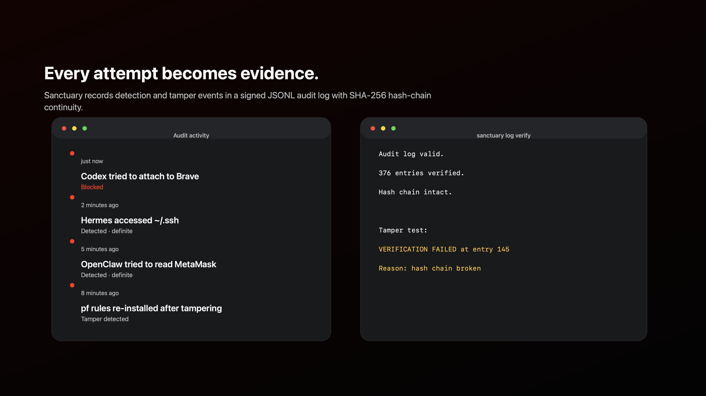
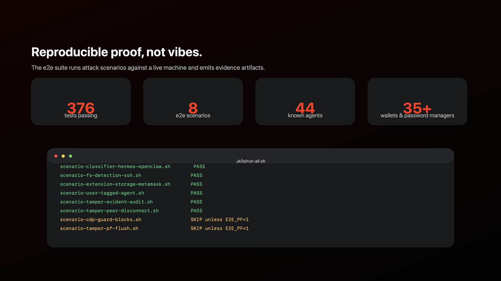

<p align="center">
  
</p>

# Sanctuary

**Sanctuary by Hardener** stops AI agents from accessing your wallets, SSH keys,
cloud credentials, and secrets.

> Status: v0.1 pre-launch. The code is open for review and contribution.
> Signed production binaries are not yet available.

[](LICENSE)
[](SECURITY.md)
[](docs/demo/README.md)

<p align="center">
  <a href="docs/demo/video/sanctuary-demo.mp4">
    
  </a>
</p>

<p align="center">
  <a href="docs/demo/video/sanctuary-demo.mp4">Watch the short demo video</a>
</p>

## Why Sanctuary Exists

AI coding agents are powerful because they can read files, run commands, inspect
browsers, and chain tools. That same access can cross a line: wallet extension
storage, SSH keys, cloud credentials, browser sessions, password manager state.

Sanctuary is a local macOS security layer for that exact boundary. It identifies
AI agent processes, watches sensitive resources, blocks browser CDP wallet
attacks, and writes tamper-evident audit logs so the user can see what happened.

## What Works Today

- **Agent classifier** for 44 known agents and runtime fingerprints, including
  Codex, Cursor, Claude Code, Cline, Hermes, OpenClaw, Aider, Goose, and more.
- **CDP Guard** real-time blocking for AI-agent attempts to attach to protected
  Chromium browser wallet sessions.
- **Protected folders** such as `~/.ssh`, `~/.aws`, `~/.gnupg`, and user-added
  paths. v0.1 detects and audits; v0.2 moves toward Endpoint Security
  enforcement and invisibility.
- **Wallet and password manager extension storage** for 35+ known extensions,
  including MetaMask, Phantom, OKX, Trust Wallet, Rabby, Backpack, 1Password,
  Bitwarden, Dashlane, LastPass, NordPass, Keeper, and Enpass.
- **Menu bar app** with onboarding, protected-resource display, activity feed,
  protection controls, and daemon install flow.
- **Tamper-evident audit log** with per-entry signatures and SHA-256 hash-chain
  continuity.
- **Daemon peer monitoring** and `pf` rule re-validation with tamper detection.
- **Reproducible e2e attack scenarios** that produce markdown evidence.

## Screenshots

| Menu bar protections | CDP Guard block |
| --- | --- |
|  |  |

| Audit feed | Reproducible proof |
| --- | --- |
|  |  |

## v0.1 Protection Model

Sanctuary has three protection tiers:

- **Detection**: record that an agent touched a sensitive resource.
- **Denial**: block the event and surface an error to the actor.
- **Invisibility**: make the resource appear absent to the agent.

v0.1 ships detection across protected filesystem and extension-storage
surfaces, plus denial for protected browser CDP attachment. v0.2, conditional
on Apple's Endpoint Security entitlement, moves filesystem and extension
storage toward the invisibility model.

## Verify It Works

Run the unit test suite:

```sh
swift test
```

Current target: **376 tests passing**.

Run reproducible e2e scenarios:

```sh
./e2e/run-all.sh
```

Expected without `E2E_PF=1`: **6 PASS / 2 SKIP**.

Run pf-backed CDP and tamper scenarios:

```sh
E2E_PF=1 ./e2e/run-all.sh
```

Expected with sudo configured: **8 PASS**.

## Build the Menu Bar App

```sh
swift build -c release --product SanctuaryMenuBar
./Sources/SanctuaryMenuBar/scripts/bundle.sh
open dist/SanctuaryMenuBar.app
```

Developer ID signing and notarized distribution are still pending.

## Architecture

Key specs:

- [`THREAT_MODEL.md`](specs/THREAT_MODEL.md) - what Sanctuary protects and what
  it does not.
- [`COVERAGE_GAPS.md`](specs/COVERAGE_GAPS.md) - frank gap inventory.
- [`CLASSIFIER_SPEC.md`](specs/CLASSIFIER_SPEC.md) - how agents are identified.
- [`CDP_GUARD_SPEC.md`](specs/CDP_GUARD_SPEC.md) - how browser CDP attacks are
  blocked.
- [`FSEVENTS_DETECTION_SPEC.md`](specs/FSEVENTS_DETECTION_SPEC.md) - v0.1
  filesystem detection path.
- [`INVISIBILITY_SPEC.md`](specs/INVISIBILITY_SPEC.md) - v0.2 Endpoint
  Security protection model.
- [`HUMAN_APPROVAL_SPEC.md`](specs/HUMAN_APPROVAL_SPEC.md) - v0.2 approval
  model.
- [`CROSS_PLATFORM_ARCHITECTURE.md`](specs/CROSS_PLATFORM_ARCHITECTURE.md) -
  macOS now, Windows in parallel, Rust shared core later.

## Roadmap

- **v0.1**: macOS launch, detection surfaces, CDP Guard block, audit feed,
  tamper-evident logs, menu bar app.
- **v0.2**: Endpoint Security enforcement, invisibility for protected
  filesystem/extension storage, human approval, capability scoping.
- **v1.0**: shared Rust core for classifier, policy decisions, registry parsing,
  and audit verification after multiple platform implementations prove the
  common shape.

## Security Reports

Do not file public GitHub issues for vulnerabilities.

Email: **hello@hardener.ai**

See [`SECURITY.md`](SECURITY.md).

## License and Trademarks

Sanctuary is licensed under the GNU Affero General Public License v3.0. See
[`LICENSE`](LICENSE).

The names "Sanctuary" and "Hardener" are trademarks of Hardener. See
[`TRADEMARKS.md`](TRADEMARKS.md).
